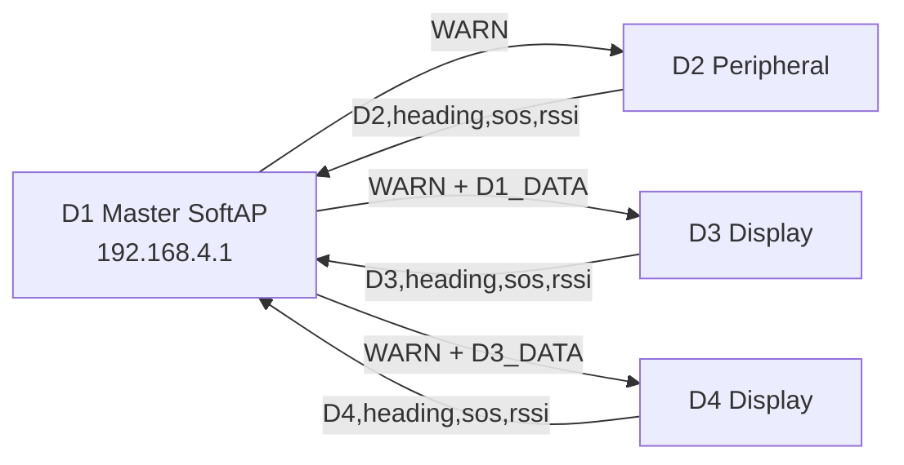

# GroupGuard

GroupGuard is a four-device ESP32 safety and proximity system. D1 creates the WiFi access point and acts as the master relay, while D2, D3, and D4 report compass heading, SOS state, and WiFi RSSI-derived distance.

## Firmware Layout

| Device | Sketch | Role |
| --- | --- | --- |
| D1 | `firmware/D1_Master/D1_Master.ino` | SoftAP, TCP server, warning sender, display master |
| D2 | `firmware/D2_Peripheral/D2_Peripheral.ino` | Headless peripheral with vibration and LED alerts |
| D3 | `firmware/D3_Display/D3_Display.ino` | Display peripheral showing D1 and D4 |
| D4 | `firmware/D4_Display/D4_Display.ino` | SPI display peripheral showing D3 and self |

## Architecture



## WiFi

D1 starts a SoftAP:

| Setting | Value |
| --- | --- |
| SSID | `GroupGuard` |
| Password | `Groupguard@0826` |
| D1 IP | `192.168.4.1` |
| D1 server port | `12345` |
| Peripheral server port | `54321` |

D1 does not show the WiFi password on the OLED during startup.

## Hardware Pins

| Device | Button | Vibration | LED | I2C | Display |
| --- | --- | --- | --- | --- | --- |
| D1 | GPIO 15, pulldown, active-high | GPIO 5 | None | SDA 21, SCL 22 | I2C SSD1306 |
| D2 | GPIO 15, pulldown, active-high | GPIO 5 | GPIO 25 | SDA 21, SCL 22 | None |
| D3 | GPIO 15, pulldown, active-high | GPIO 5 | None | SDA 21, SCL 22 | I2C SSD1306 |
| D4 | GPIO 27, pullup, active-low | GPIO 26 | GPIO 25 | SDA 21, SCL 22 | SPI SSD1306, DC 5, RST 4 |

D4 intentionally keeps its existing active-low button wiring.

## Protocol

Peripheral uplink to D1:

```text
D#,<heading>,<sos>,<rssi>
```

D1 to D3:

```text
D1_DATA,<d1Heading>,<d3Distance>,<d4Heading>,<d4Distance>,<d4Sos>,<d4Active>
```

D1 to D4:

```text
D3_DATA,<d3Heading>,<d3Distance>,<d3Sos>,<d3Active>
```

Warning packet:

```text
WARN
```

## Flashing

Open each `.ino` in Arduino IDE from its matching folder, select the ESP32 board and port, install the required libraries, then upload:

- `WiFi`
- `Wire`
- `SPI`
- `QMC5883LCompass`
- `Adafruit GFX Library`
- `Adafruit SSD1306`

Flash D1 first so the `GroupGuard` access point is available, then flash D2, D3, and D4.
